## What is string in Javascript?

### Строка - это тип данных, используемый в языках программирования, представляющих текст. Он включает набор символов, которые также могут содержать пробелы и цифры. Например, слово “автомобиль" и фраза “У меня четыре машины” — оба относятся к категории строк. Обычно программисты заключают строки в кавычки.

## Method Javascript
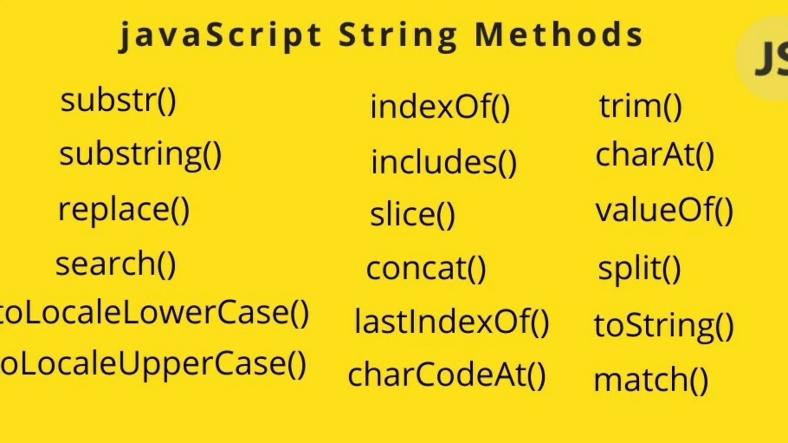

### Method substr()
### substr() Метод String values возвращает часть этой строки, начинающуюся с указанного индекса и расширяющуюся на заданное количество символов впоследствии.

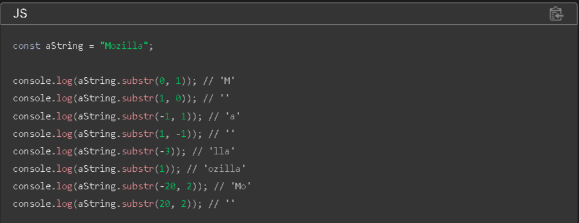

## Method substring()
### Метод Java String substring() используется для извлечения подстроки объекта String. Подстрока начинается с символа с заданным индексом и продолжается до конца текущей строки.
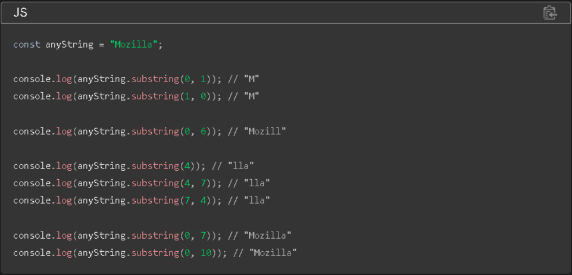

## method replace()
### replace() Метод String values возвращает новую строку с одним, некоторыми или всеми совпадениями a, pattern замененными на a replacement. patternможет быть строкой или a RegExp, а replacement может быть строкой или функцией, вызываемой для каждого совпадения. Если pattern является строкой, будет заменено только первое вхождение. Исходная строка остается неизменной.
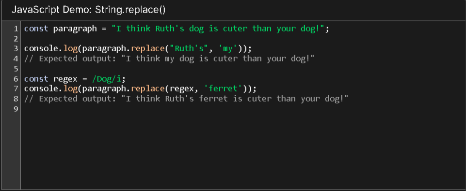

## Method toLocalLowerCase()
### toLocaleLowerCase() Метод String values возвращает эту строку, преобразованную в нижний регистр, в соответствии с любыми сопоставлениями регистра, зависящими от конкретной локали.
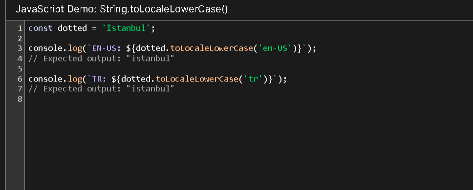

## Method toLocalUpperCase
### toLocaleUpperCase() Метод String values возвращает эту строку, преобразованную в верхний регистр, в соответствии с любыми сопоставлениями регистра, зависящими от конкретной локали.
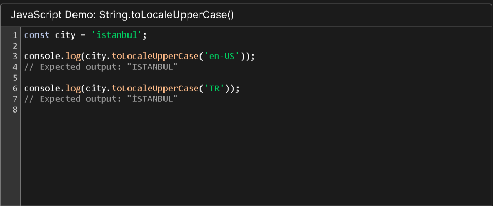

## Method  Indexof()
### В JavaScript indexOf() - это строковый метод, который используется для нахождения местоположения подстроки в строке. Поскольку метод indexOf() является методом объекта String, он должен вызываться через конкретный экземпляр класса String.
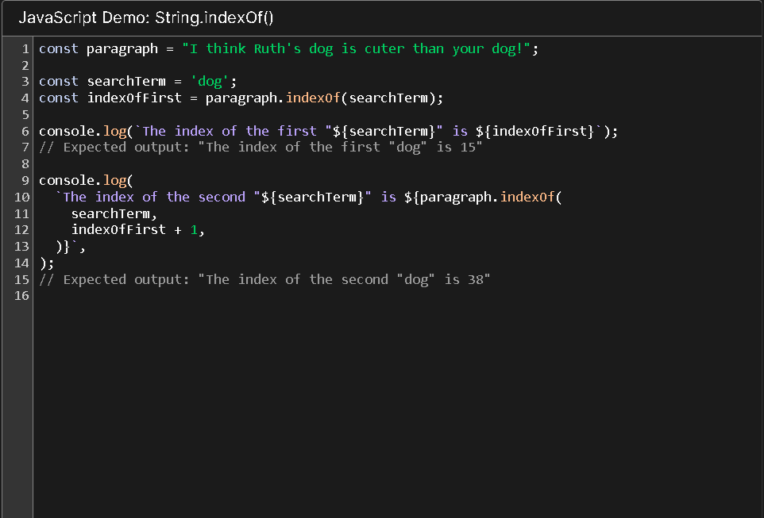

## Method includes()
### includes() Метод String значений выполняет поиск с учетом регистра, чтобы определить, может ли данная строка быть найдена внутри этой строки, возвращая true или false соответствующим образом.
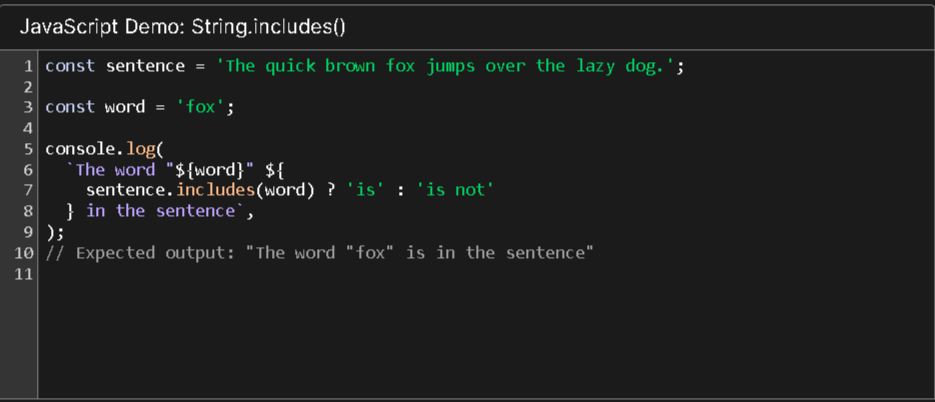

## Method slice()
### slice() Метод String values извлекает раздел этой строки и возвращает его как новую строку, без изменения исходной строки.
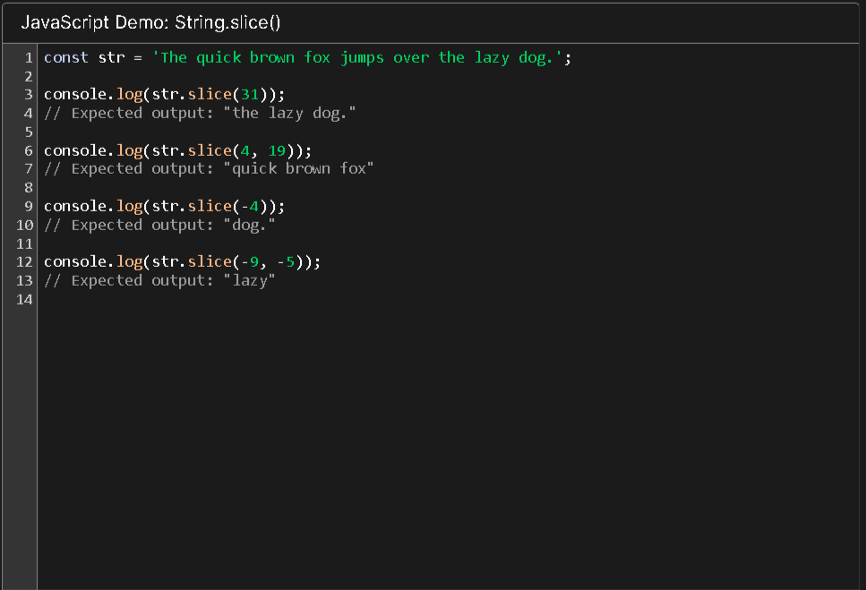

## Method concat()
### concat() Метод String values объединяет строковые аргументы с этой строкой и возвращает новую строку.
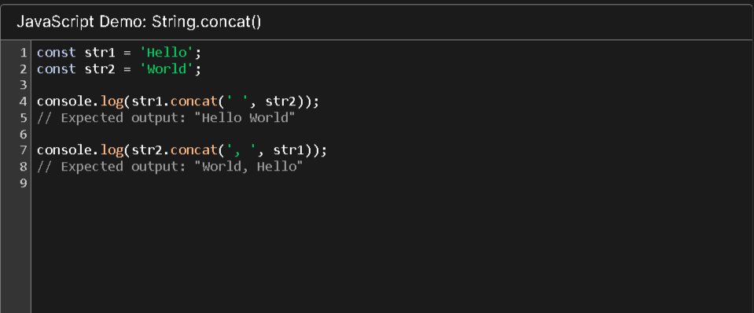

## Method lastindex()
### lastIndexOf() Метод String values выполняет поиск в этой строке и возвращает индекс последнего вхождения указанной подстроки. Он принимает необязательную начальную позицию и возвращает последнее вхождение указанной подстроки с индексом, меньшим или равным указанному номеру.
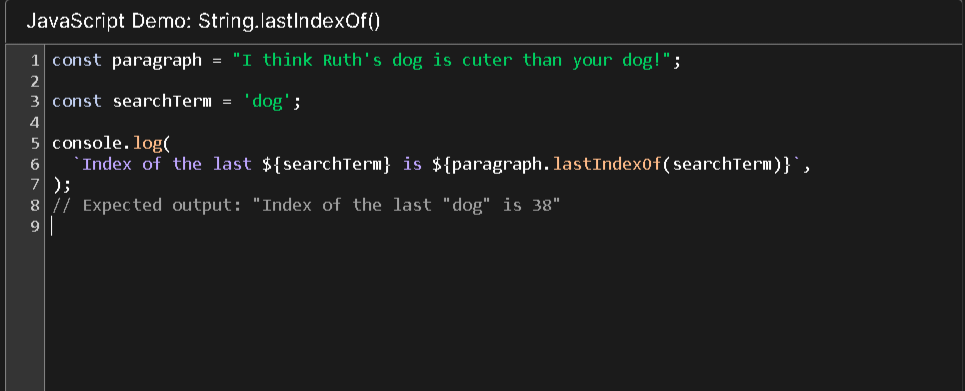

## Method trim()
### trim() Метод String values удаляет пробелы с обоих концов этой строки и возвращает новую строку, не изменяя исходную строку.
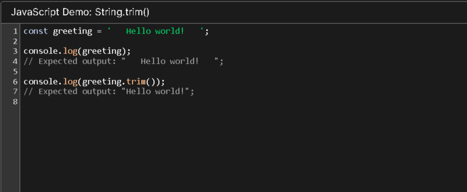

## Method Charat()
### charAt() Метод String values возвращает новую строку, состоящую из одной единицы кода UTF-16 с заданным индексом.
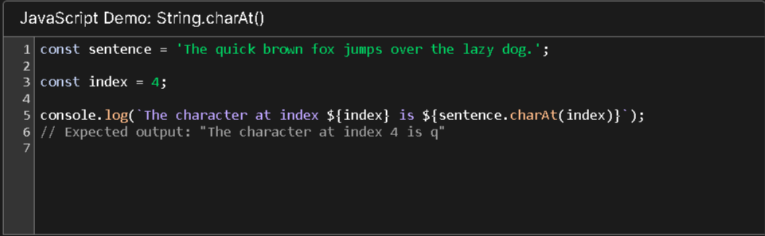

## Method split()
### split() Метод String values принимает шаблон и разбивает эту строку на упорядоченный список подстрок путем поиска шаблона, помещает эти подстроки в массив и возвращает массив.
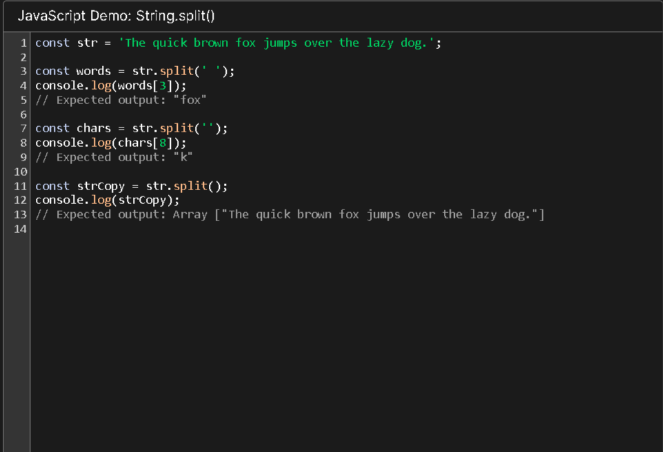

## Method toString()
### toString() Метод String values возвращает это строковое значение.
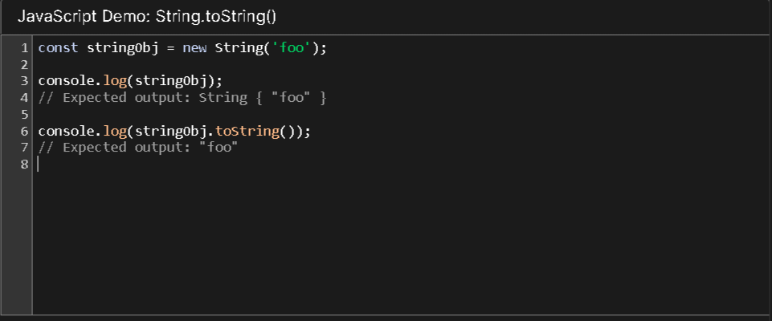